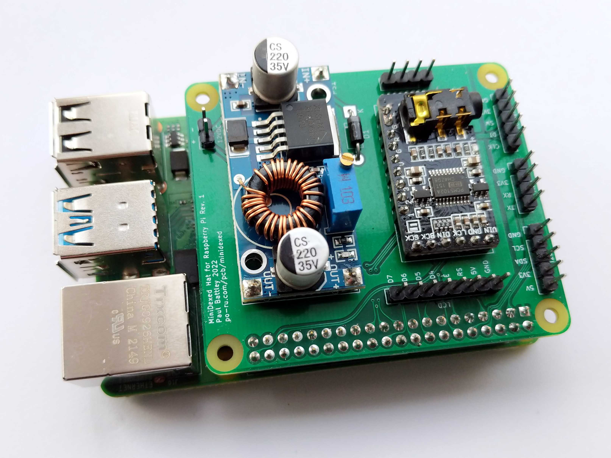

# MiniDexed Hat for Raspberry Pi

This aims to make the construction of a
[MiniDexed](https://github.com/probonopd/MiniDexed) a little easier.

Features:

- On-board step-down converter to run from a typical 12V wall-wart power supply
  to sidestep the exacting USB-C requirements of the Raspberry Pi 4
- Direct mounting for a PCM5102A audio module, with output routed to headers
- Headers for connecting peripherals:
  - 8 pins for a 1602 display (using [this backpack
    board](https://po-ru.com/pcb/1602))
  - I2C for an OLED display
  - Left and right line out
  - Serial MIDI for a [3.3V MIDI interface](https://po-ru.com/pcb/midi)
  - KY-040 encoder module

Revision 1 does not include debouncing capacitors for the encoder. I intend to
make my own encoder boards with better debouncing.

The PCB dimensions are based on [Seth Hillbrand's
template](https://github.com/sethhillbrand/kicad_templates) for a Raspberry Pi
hat.

With an appropriate display, this board should also work with
[mt32-pi](https://github.com/dwhinham/mt32-pi), but I have not tested it.

## Warning

Set the voltage on the converter **before** soldering the audio interface in
place or installing the hat on the Pi. I recommend around 5.2V.
